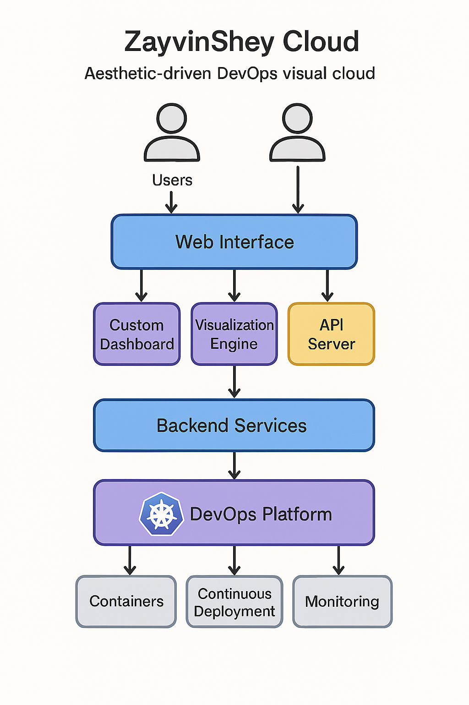

# 🌌 ZayvinShey Cloud

ZayvinShey Cloud - DevOps 可视化云平台
致热爱开源的理想主义者 以及每一个执着于云端构建的你 

---

## ✨ 项目愿景

> “不只是完成一个毕业作品，更是创建一个能代表我理念的云平台。”

我想打造一个可视化的DevOps云平台平台 - ZayvinShey Cloud ，融合自动化部署、系统监控，为用户构建一个既高效又富有个性表达的数字控制空间。它不仅是技术实践的集合，更是探索如何将系统设计与视觉体验紧密融合的实验场。

这个项目既是我 2025-2027 毕业设计的核心内容，也是我对未来个人数字生态的一次深度构建尝试。

---

## 🔧 技术栈与架构

- 前端：React + TailwindCSS
- 后端：Node.js / Python Flask
- 容器平台：Kubernetes (K8s) + containerd
- DevOps 核心：Argo CD, Prometheus, Grafana
- 数据存储：SQLite / JSON

---

