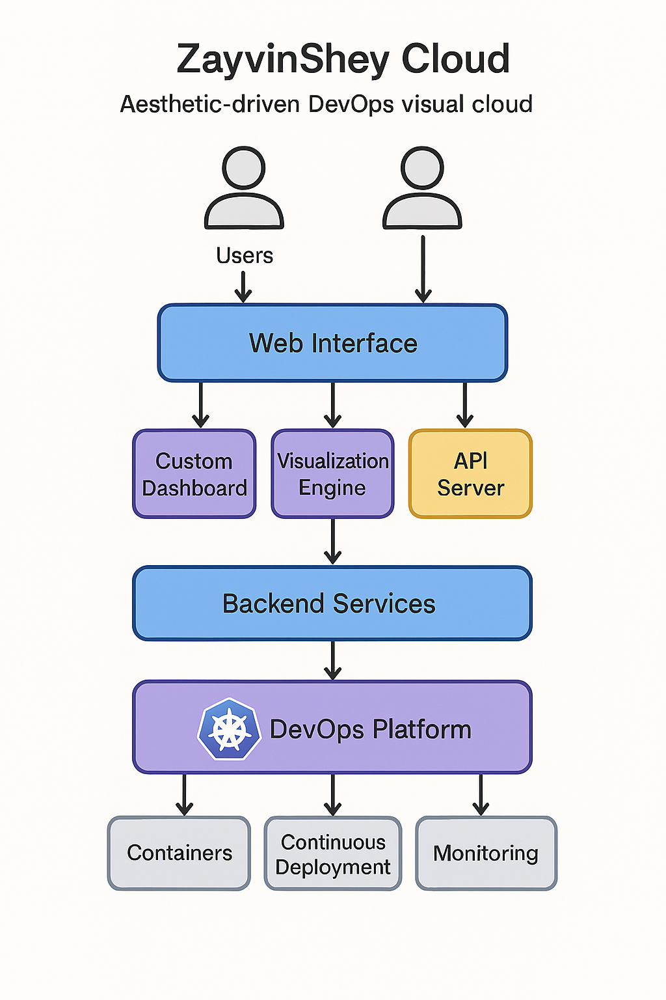

# 🌌 ZayvinShey Cloud

ZayvinShey Cloud - DevOps 可视化云平台

---

## ✨ 项目愿景

> “目前只是想完成2025-2027段毕业设计”
> “致热爱开源的理想主义者 以及每一个执着于云端构建的你”

ZayvinShey Cloud 基于Kubernetes的DevOps

---

## 🧩 特性亮点

- 🎨 审美驱动界面（定制化仪表板、UI 动效）
- ⚙️ 模块化架构（独立部署模块，便于维护与扩展）
- 📊 DevOps 可视化控制（实时监控 + 可视化部署流程）
- 🔐 安全性保障（支持本地和 OAuth2 认证）
- 🚀 启动器脚本（带 ASCII logo 欢迎界面）

---

## 🔧 技术栈与架构

- 前端：React + TailwindCSS
- 后端：Node.js / Python Flask
- 容器平台：Kubernetes (K8s)
- DevOps 核心：Argo CD, Prometheus, Grafana
- 数据存储：SQLite / JSON

---

